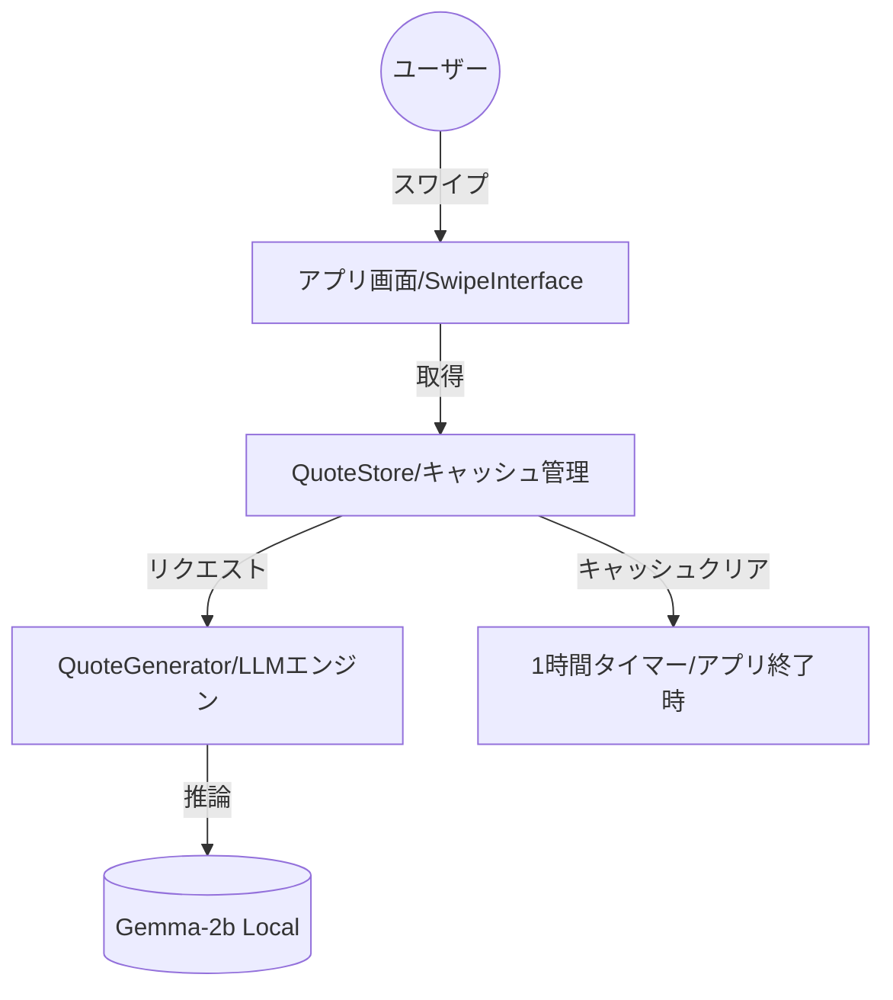

# システム設計書 (Architecture) - 偉人の迷言アプリ

## 1. 技術スタック
- **Frontend**: React Native (Expo)
- **Language**: TypeScript
- **LLM Engine**: MediaPipe LLM Inference API
- **LLM Model**: Gemma-2b-it-cpu-int4 (軽量・高速版)
- **Animations**: React Native Reanimated
- **Gesture Control**: React Native Gesture Handler
- **Local Cache**: React Context + In-memory Array (100件限定)

## 2. システム全体図

## 3. データフロー
1.  **初期化**: アプリ起動時にLLMモデルをロード。
2.  **バックグラウンド生成**: `QuoteStore` が空、または残り少なくなると `QuoteGenerator` に30件の生成を依頼。
3.  **推論**: LLMが「架空の偉人の名前」「肩書き」「名言内容」をJSON形式で生成。
4.  **表示**: ユーザーがスワイプするたびに、キャッシュから次の名言をポップ。
5.  **揮発**: アプリを完全に閉じるか、一定時間経過でキャッシュ配列を `[]` にリセット。
